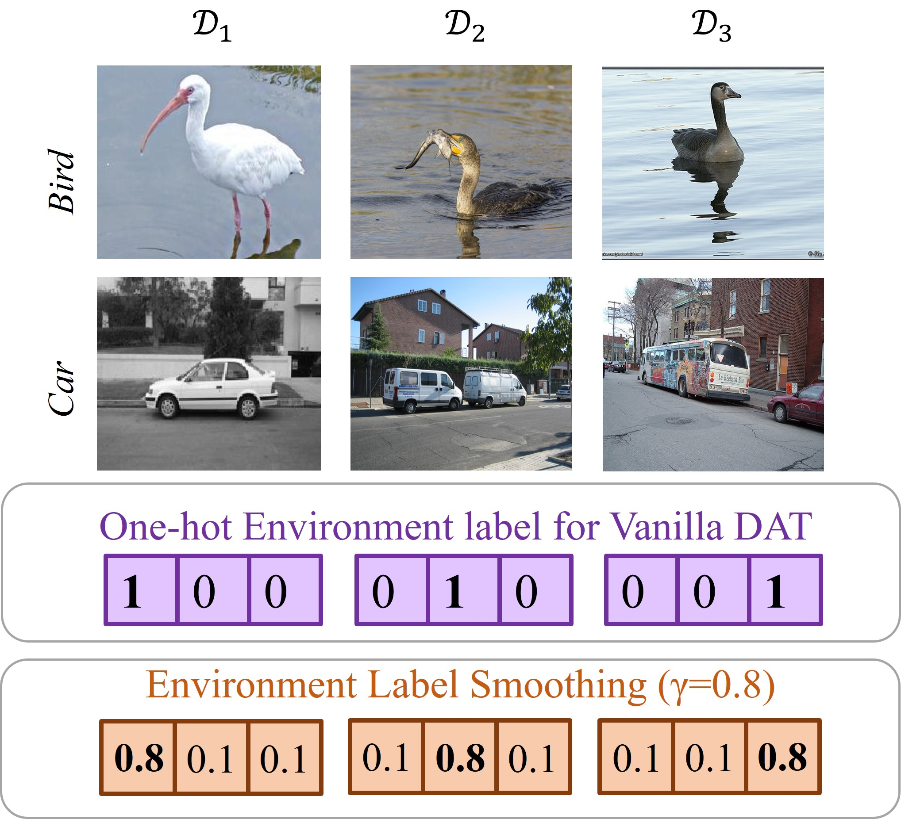

# Environment Label Smoothing, ICLR, 2023

[](#python)
[](https://opensource.org/licenses/MIT)

This is an official PyTorch implementation of the paper [Free Lunch for Domain Adversarial Training: Environment Label Smoothing](). 

**With a very simple smoothing trick, the method can boost the generalization/adaptation performance of previous adversarial training-based methods by a large margin.**

[](https://paperswithcode.com/sota/domain-adaptation-on-office-home?p=free-lunch-for-domain-adversarial-training)

[](https://paperswithcode.com/sota/domain-adaptation-on-office-31?p=free-lunch-for-domain-adversarial-training)


## Abstract 
A fundamental challenge for machine learning models is how to generalize learned models for out-of-distribution (OOD) data. Among various approaches, exploiting invariant features by Domain Adversarial Training (DAT) received widespread attention. Despite its success, we observe training instability from DAT, mostly due to over-confident domain discriminator and environment label noise. To address this issue, we proposed Environment Label Smoothing (ELS), which encourages the discriminator to output soft probability, which thus reduces the confidence of the discriminator and alleviates the impact of noisy environment labels. We demonstrate, both experimentally and theoretically, that ELS can improve training stability, local convergence, and robustness to noisy environment labels. By incorporating ELS with DAT methods, we are able to yield state-of-art results on a wide range of domain generalization/adaptation tasks, particularly when the environment labels are highly noisy.
<div align=center>


</div>

### Dependencies
Dependencies of different settings are listed in each subfolder.

#### Table.2 and Table.4 for Domain adaptation
./Domain_Adaptation

#### Table.3, Table.13, and Table.17 for Domain Generalization
./Domain_Generalization

#### Table.5 and Figure.3 for Continuous Domain Adaptation
./Continuous_Domain_Adaptation

#### Table.6, Table.7, Table.14 for NLP, Genomics, and Graph
./NLP_Genomics_Graph

#### Table.16 for Image Retrevial
./Image_Reterival

#### Table.15, Table.18 for Sequence Prediction Tasks
./Sequential_Prediction

### Citation 
If you find this repo useful, please consider citing: 
```
@inproceedings{
anonymous2023free,
title={Free Lunch for Domain Adversarial Training: Environment Label Smoothing},
author={Anonymous},
booktitle={Submitted to The Eleventh International Conference on Learning Representations },
year={2023},
url={https://openreview.net/forum?id=GPTjnA57h_3},
note={under review}
}
```

